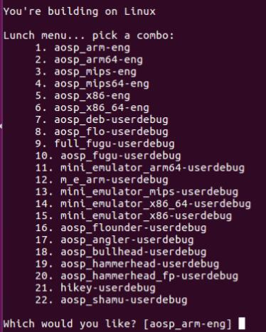

# Android 源码编译的四个流程：
1.源码下载，2.构建编译环境，3.编译源码，4.运行
我这里的环境是ubuntu16.04(64位)，android版本是8.1.0，空间至少150G(注意)

## 源码下载
众周所知由于谷歌被墙，所以我们这里采用国内的镜像进行下载，我们这里选择[清华镜像源](https://mirrors.tuna.tsinghua.edu.cn/help/AOSP/)

下载Repo工具，AOSP使用Repo工具对源代码进行管理，是一种对Git构成补充的Google代码库管理工具

```
mkdir ~/bin
PATH=~/bin:$PATH
curl https://mirrors.tuna.tsinghua.edu.cn/git/git-repo > ~/bin/repo
chmod a+x ~/bin/repo
```

创建源码存放文件夹，后面所有的下载源码和编译都放这里。

```
mkdir aosp
cd aosp
```

配置git

```
git config --global user.name "Your Name"
git config --global user.email "you@example.com"
```

运行repo init初始化仓库，必须指定一个网址，该网址用于指定 Android 源代码中包含的各个代码库将位于工作目录中的什么位置。

```
repo init -u https://android.googlesource.com/platform/manifest
```

要检出“master”以外的分支，请使用 -b 指定相应分支。要查看[分支列表](https://source.android.google.cn/setup/start/build-numbers.html#source-code-tags-and-builds)

```
repo init -u https://android.googlesource.com/platform/manifest -b android-8.1.0_r52
```

初始化仓库之后，就可以正式同步代码到本地了，

```
repo sync
```

中间可能会中断几次，使用该命令继续同步即可。6，7个小时应该就是同步完成了，一定要确认代码同步晚上，不能有error，要不然编译会有一些莫名其妙的问题。

## 构建编译环境
安装编译所需要的依赖库

```
sudo apt update

sudo apt install git-core gnupg flex bison gperf build-essential zip curl zlib1g-dev gcc-multilib g++-multilib libc6-dev-i386 lib32ncurses5-dev x11proto-core-dev libx11-dev lib32z-dev ccache libgl1-mesa-dev libxml2-utils xsltproc unzip openjdk-8-jdk
```

初始化编译环境

```
source build/envsetup.sh
```

选择编译目标

```
lunch 
```



输入相对应的数字即可，我们这里输入 2 

所有编译目标都采用 BUILD-BUILDTYPE 形式，其中 BUILD 是表示特定功能组合的代号。BUILDTYPE 是以下类型之一：

编译类型 | 说明
--------- | -------------
user | 权限受限；适用于生产环境
userdebug | 与“user”类似，但具有 root 权限和可调试性；是进行调试时的首选编译类型
eng | 具有额外调试工具的开发配置

因为我们这边编译的是8.1版本，默认使用的是jack，Jack 是 Android 6.0 - 8.1 的默认 Android 编译工具链。这里还需要设置一下JACK_SERVER_VM_ARGUMENTS，不然可能会报 Out of memory error

```
export JACK_SERVER_VM_ARGUMENTS="-Dfile.encoding=UTF-8 -XX:+TieredCompilation -Xmx4g"
```

## 开始编译源码
使用make指令进行代码编译，可以借助 -jN 参数处理并行任务，通常使用的任务数 N 介于编译时所用计算机上硬件线程数的 1-2 倍之间，

```
make -j8 
```

## 运行Android模拟器

```
emulator
```

如果报错，配置一下环境

```
export PATH=$PATH:/aosp/out/host/linux-x86/bin
export ANDROID_PRODUCT_OUT=/aosp/out/target/product/generic
emulator
```

## 切换Android版本

```
rm -rf .repo/manifest*
repo init repo init -u https://android.googlesource.com/platform/manifest -b android-9.0.0_r22
repo sync
```


